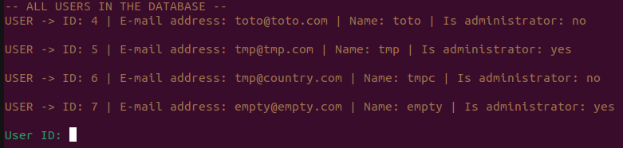
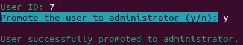
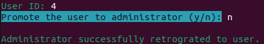
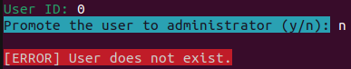

# Guide de déploiement

### Par Briend Donovan, Crispel Clément, El Mesaoudi Meftah Younes, Le Flohic Carole et Noyer Emilien

>## Sommaire
>[1. Contexte](#contexte)  
>[2. Prérequis](#prérequis)  
>[3. Installation de la Base de Données](#installation-de-la-base-de-données)  
>[4. Rappel des fonctionnalités disponibles par un administrateur](#rappel-des-fonctionnalités-disponibles-par-un-administrateur)  
>[5. Rappel des fonctionnalités disponibles par un super-administrateur](#rappel-des-fonctionnalités-disponibles-par-un-super-administrateur)  
>[6. Nomage d'un administrateur ](#nomage-dun-administrateur )
___

## Contexte

Ce guide de déploiement servira au super-administrateur à se différencier des autres administrateurs, et de savoir comment nommer d’autres administrateurs. 

___

## Prérequis

Afin de pouvoir travailler sur ce projet, vous aurez besoin d'avoir sur votre ordinateur 

- Symfony d'installé. 

    (Si ce n'est pas le cas, alors : 

    Pour télécharger Symfony : https://symfony.com/download

    Pour Symfony, nous vous recommandons de télécharger la version **binaire AMD64**.)

- d'avoir la bonne base de données à disposition dans le fichier **.env** (si ce n'est pas le cas, veuillez vous référer à la partie [Installation de la Base de Données](#installation-de-la-base-de-données) )

___

## Installation de la Base de Données

Avant de pouvoir utiliser votre site, il est possible que vous n'ayez pas accès à votre propre base de données. Si votre est déjà mis en place et utilisable, alors vous n'avez pas à vous inquiéter pour cette partie.

Dans un premier temps, vous aurez besoin d'aller récuperer le corps de votre base de données, disponible à l'adresse suivante (lien du téléchargement direct) : 
https://gregwar.com/s3web/files/shows.sql.zip

Nous montrerons ensuite comment utiliser cette base de données depuis nos comptes sur phpMyAdmin. 
https://apps.iut.u-bordeaux.fr/phpmyadmin/ 

Nous ne serons malheuresement pas en capacité de vous donner des instructions sur un autre serveur, ou de vous aider à avoir un compte phpMyAdmin, étant donné que ceux-ci nous ont été donnés par le département universitaire de Bordeaux.

Dans notre cas, nous nous sommes connectés avec nos comptes en choisissant le serveur info-titania.

Allez ensuite sur importer, et choisissez le zip que vous avez téléchargé précédemment (gros bouton à côté de "choisissez un fichier"), puis exécutez (gros bouton exécuter). 

Il est possible que phpMyAdmin refuse de créer votre base de données si vous avez déjà une base de données. Il faudra alors supprimer la base de données précédente. **Veuillez tout de même récupérer cette base de données autre part si vous en avez toujours besoin.**

Maintenant que vous avez mis en place votre base de données, veuillez aller dans le fichier .env de votre projet symfony. Complétez la ligne suivante : 

```
#DATABASE_URL=mysql://root:@127.0.0.1:3306/shows**
```
Veuillez compléter cette ligne de la manière suivante : 
```
DATABASE_URL=mysql://***nom_de_l'utilisateur*** :***mot_de_passe***@info-titania:3306/***nom_de_la_base***
```
Vous pourrez ainsi utiliser votre base de donnée pour votre projet symfony.

Comme le projet a initialement besoin de faire une légère modification sur la base de donnée, vous aurez besoin d'écrire dans votre terminal la commande suivante (vous pouvez aussi utiliser cette commande si vous la modifiez) :

```
symfony console doctrine:schema:update --force
```
___


## Rappel des fonctionnalités disponibles par un administrateur

Tout d’abord, voici un rappel des fonctionnalités supplémentaires qu’a un administrateur par rapport à un utilisateur lambda. 
Un administrateur peut : 
- Consulter la liste des utilisateurs inscrits
- Incarner un utilisateur (**attention** : cette fonctionnalité a été prévue afin qu’un administrateur puisse observer la vue d’un utilisateur, et donc vérifier que la vue est conforme aux souhaits des gérants du site. Si l’administrateur a modifié des données de son incarnation, l’administrateur devra donc être responsable de remettre par lui-même les données de l’utilisateur incarné à son état d’origine à la fin de son incarnation.) 
- Pouvoir faire des modifications sur le compte d'un autre utilisateur

___

## Rappel des fonctionnalités disponibles par un super-administrateur

Le super-administrateur a aussi accès aux fonctionnalités précédentes, ainsi qu’à la fonctionnalité supplémentaire : ajouter des administrateurs. 

Cela se fait à partir de son terminal, depuis le dossier du projet symfony.
___


## Nomage d'un administrateur 

Pour nommer un administrateur, veuillez ouvrir un terminal depuis votre dossier symfony. Veuillez ensuite taper la commande suivante : 

```
symfony console administration:manage
```

Cela permettra de lancer le programme. 

Le script va alors commencer en vous montrant la liste des utilisateurs, avec leur ID, mail, nom, et s'ils sont ou non des administarteurs : 

 

Après cela, veuillez entrer l'ID de l'utilisateur auquel vous voulez retoucher. Vous pouvez toujours utiliser CTRL+C si vous voulez annuler votre traitement.

Après avoir saisie l'ID de la personne, vous aurez le choix entre *promouvoir* un utilisateur, ou le *rétrograder*. Envoyez ***y*** pour que la personne soit administrateur, ou ***n*** pour qu'elle soit un simple utilisateur. Choisir de promouvoir un administrateur, ou de retrograder un utilisateur lambda ne changera rien à votre base de données. Vous pouvez toujours utiliser CTRL+C pour ne rien changer.  

 

 

Si vous saisissez un ID non présent dans votre base de donnée, un message d'erreur apparaitra après votre choix.

 

La commande n'étant prévue que pour être utilisé pour une seule modification, vous devrez réexécuter la commande si vous voulez faire une autre modification. 