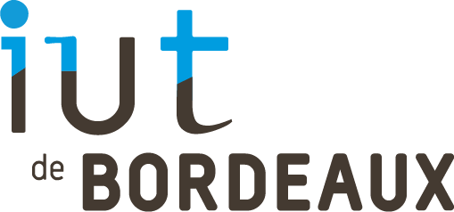

# STANDARDS DE DÉVELOPPEMENT



### Membres de l'équipe : El Mesaoudi Meftah Younes, Le Flohic Carole, Crispel Clément, Noyer Émilien, Briend Donovan

## Pour le développement de notre application, nous allons utiliser les standards de développement suivants : 
Nous avons décidé de respecter la norme PSR-12, qui est un ensemble de directives de style de codage pour PHP. Il s'appuie sur PSR-1 (Basic Coding Standard) et PSR-2 (Coding Style Guide), et ajoute des recommandations supplémentaires concernant les conventions de nommage, l'indentation et d'autres détails. Voici les points clés de PSR-12 :

- Les noms de fichiers doivent utiliser uniquement des lettres minuscules et des traits d'union, avec une extension de fichier .php.
- Les espaces de nommage doivent être en majuscules (PascalCase) et les classes en minuscules (CamelCase).
- Les constantes, propriétés et méthodes des classes doivent être en minuscules (camelCase).
- L'indentation doit être de 4 espaces, sans tabulation.
- Il doit y avoir une ligne vide après la déclaration de l'espace de noms et une ligne vide avant la définition de la classe.
- Il doit y avoir une ligne vierge entre les méthodes d'une classe.
- Les accolades doivent être sur la même ligne que la déclaration à laquelle elles sont associées.
- Il ne doit pas y avoir d'espace à la fin d'une ligne.
- Utilisez des guillemets simples pour les chaînes de caractères, sauf si vous devez utiliser une variable dans la chaîne ou si vous devez échapper à un guillemet simple.
- Un espace doit être ajouté après le mot clé de structure de contrôle et avant la parenthèse ouvrante, et il ne doit pas y avoir d'espace entre la parenthèse fermante et l'accolade ouvrante.


## Les outils choisies pour tester nos standards 

```
Symfony check:security 
```
 permet de vérifier les failles de sécurité.
 
 Vérifie le fichier composer.lock des dépendances installées 

PHPCodeSniffer : 
- PHP_CodeSniffer est un ensemble de deux scripts PHP ;   </br>
- Le script principal phpcs qui tokenise les fichiers PHP, JavaScript et CSS pour détecter les violations d'une norme de codage définie. </br>
- Un second script phpcbf pour corriger automatiquement les violations de la norme de codage.   </br>
- PHP_CodeSniffer est un outil de développement essentiel qui garantit que votre code reste propre et cohérent.  </br>

## Les commandes à effectuer pour tester nos standards 

Symfony security : 
```
symfony check:security 
```
PHPCodeSniffer : 
```
-vendor/bin/phpcbf -v --standard=PSR12 src/
```

